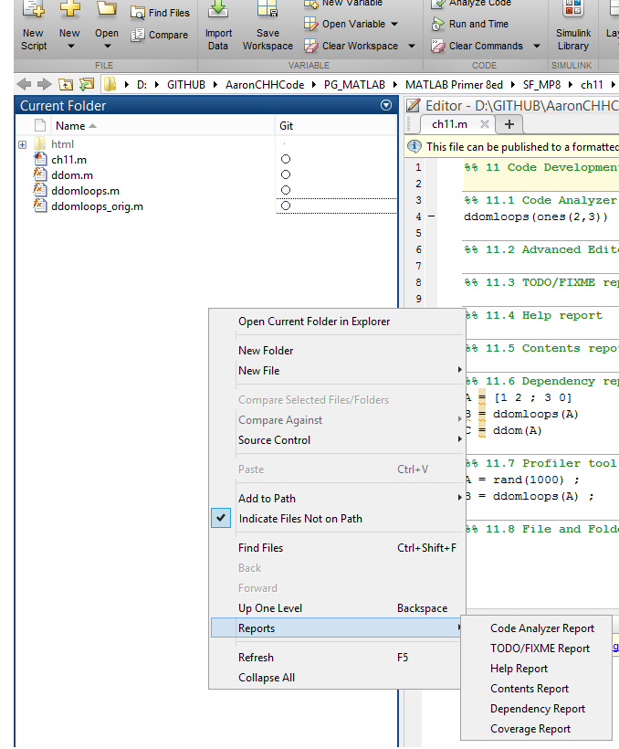

# 11 Code Development Tools


```python
%load_ext pymatbridge
```

<!-- toc orderedList:0 depthFrom:1 depthTo:6 -->

* [11 Code Development Tools](#11-code-development-tools)
  * [11.1 Code Analyzer (M-Lint) report](#111-code-analyzer-m-lint-report)
  * [11.2 Advanced Editor features](#112-advanced-editor-features)
  * [11.3 TODO/FIXME report](#113-todofixme-report)
  * [11.4 Help report](#114-help-report)
  * [11.5 Contents report](#115-contents-report)
  * [11.6 Dependency report](#116-dependency-report)
  * [11.7 Profiler tool and Coverage report](#117-profiler-tool-and-coverage-report)
  * [11.8 File and Folder Comparison tool](#118-file-and-folder-comparison-tool)

<!-- tocstop -->




## 11.1 Code Analyzer (M-Lint) report

## 11.2 Advanced Editor features

## 11.3 TODO/FIXME report

## 11.4 Help report

## 11.5 Contents report

## 11.6 Dependency report

## 11.7 Profiler tool and Coverage report

## 11.8 File and Folder Comparison tool


```python

```
