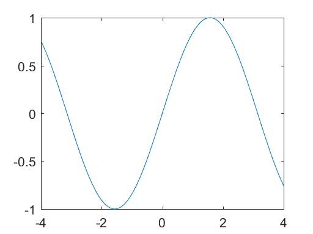
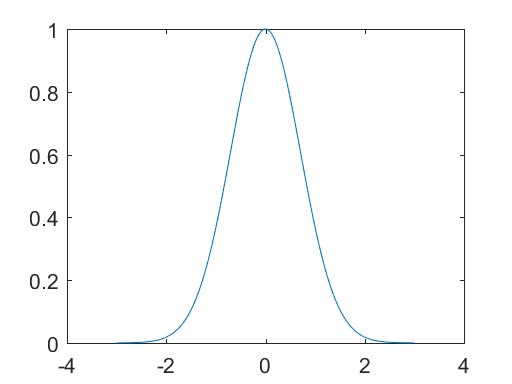
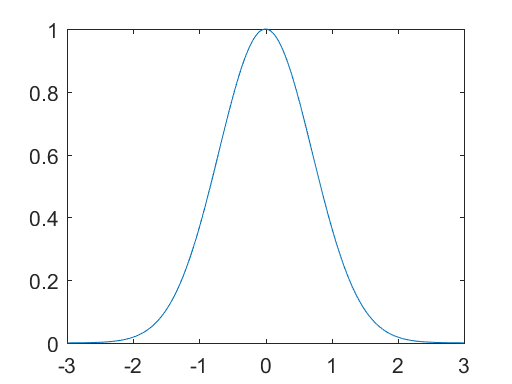
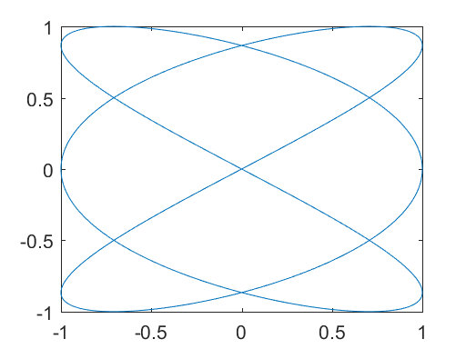
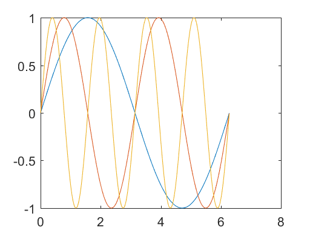
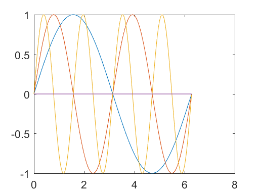
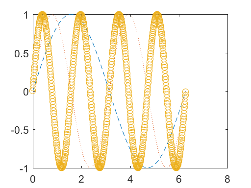
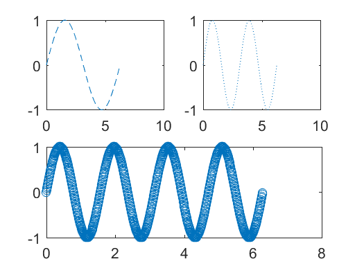

# 15 Two-Dimensional Graphics


```python
%load_ext pymatbridge
```


<!-- toc orderedList:0 depthFrom:1 depthTo:6 -->

* [15 Two-Dimensional Graphics](#15-two-dimensional-graphics)
  * [15.1 Planar plots](#151-planar-plots)
  * [15.2 Multiple figures](#152-multiple-figures)
  * [15.3 Graph of a function](#153-graph-of-a-function)
  * [15.4 Parametrically defined curves](#154-parametrically-defined-curves)
  * [15.5 Titles, labels, text in a graph](#155-titles-labels-text-in-a-graph)
  * [15.6 Control of axes and scaling](#156-control-of-axes-and-scaling)
  * [15.7 Multiple plots](#157-multiple-plots)
  * [15.8 Line types, marker types, colors](#158-line-types-marker-types-colors)
  * [15.9 Subplots and specialized plots](#159-subplots-and-specialized-plots)
  * [15.10 Graphics hard copy](#1510-graphics-hard-copy)

<!-- tocstop -->


## 15.1 Planar plots


```python
%%matlab
x = -4:0.01:4;
y = sin(x);
plot(x, y);
```





```python
%%matlab
x = -3:.01:3 ;
y = exp(-x.^2) ;
plot(x, y) ;
```





## 15.2 Multiple figures

## 15.3 Graph of a function


```python
%%matlab
fplot(@expnormal, [-3 3])
```





```python
%%matlab
f = @(x) exp(-x.^2)
fplot(f, [-3 3])
```



    f =

        @(x)exp(-x.^2)



## 15.4 Parametrically defined curves


```python
%%matlab
t = 0:.001:2*pi ;
x = cos(3*t) ;
y = sin(2*t) ;
plot(x, y) ;
```





## 15.5 Titles, labels, text in a graph

```
title   graph title
xlabel  x-axis label
ylabel  y-axis label
gtext   place text on graph using the mouse
text    position text at specified coordinates
```

## 15.6 Control of axes and scaling

```
axis([xmin xmax ymin ymax]) sets the axes
axis manual  freezes the current axes for new plots
axis auto    returns to auto-scaling
v = axis     vector v shows current scaling
axis square  axes of same size (not same scale)
axis equal   same scale and tic marks on axes
axis off     removes the axes
axis on      restores the axes
```

## 15.7 Multiple plots


```python
%%matlab
x = 0:.01:2*pi;
y1 = sin(x) ;
y2 = sin(2*x) ;
y3 = sin(4*x) ;
plot(x, y1, x, y2, x, y3)
```





```python
%%matlab
x = (0:.01:2*pi)' ;
y = [sin(x), sin(2*x), sin(4*x)] ;
plot(x, y)
```


```python
%%matlab
plot(x, y, [0 2*pi], [0 0])
```





## 15.8 Line types, marker types, colors


```python
%%matlab
x = 0:.01:2*pi ;
y1 = sin(x) ;
y2 = sin(2*x) ;
y3 = sin(4*x) ;
plot(x,y1, '--', x,y2, ':', x,y3, 'o')
```





```
'-' solid ':' dotted
'--' dashed '-.' dashdot
```

```
'.' point           'o' circle
'x' x-mark          '+' plus
'*' star            's' square
'd' diamond         'v' triangle-down
'^' triangle-up     '<' triangle-left
'>' triangle-right  'p' pentagram
'h' hexagram
```

```
'y' yellow  'm' magenta
'c' cyan    'r' red
'g' green   'b' blue
'w' white   'k' black
```

## 15.9 Subplots and specialized plots


```python
%%matlab
subplot(2,2,1)
plot(x,y1, '--')
subplot(2,2,2)
plot(x,y2, ':')
subplot(2,2,[3 4])
plot(x,y3, 'o')
```





* Other specialized planar plotting functions you may wish to explore via help are:

```
bar     feather hist  quiver  
compass fill    polar rose   stairs
```

## 15.10 Graphics hard copy


```python

```
