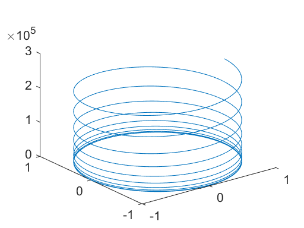
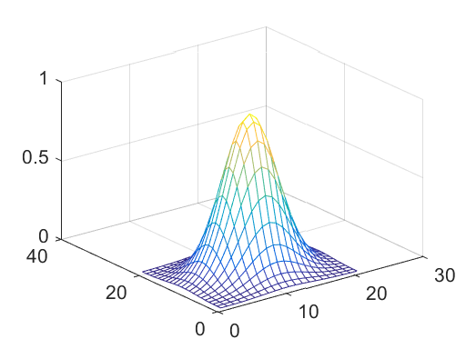
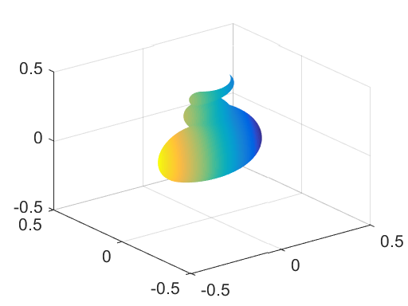
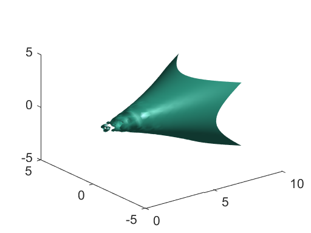
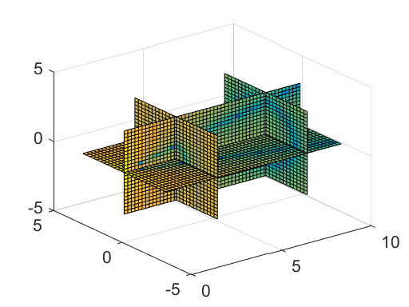

# 16 Three-Dimensional Graphics


```python
%load_ext pymatbridge
```

<!-- toc orderedList:0 depthFrom:1 depthTo:6 -->

* [16 Three-Dimensional Graphics](#16-three-dimensional-graphics)
  * [16.1 Curve plots](#161-curve-plots)
  * [16.2 Mesh and surface plots](#162-mesh-and-surface-plots)
  * [16.3 Parametrically defined surfaces](#163-parametrically-defined-surfaces)
  * [16.4 Volume and vector visualization](#164-volume-and-vector-visualization)
  * [16.5 Color shading and color profile](#165-color-shading-and-color-profile)
  * [16.6 Perspective of view](#166-perspective-of-view)

<!-- tocstop -->


## 16.1 Curve plots


```python
%%matlab
t = .01:.01:20*pi ;
x = cos(t) ;
y = sin(t) ;
z = t.^3 ;
plot3(x, y, z)
```





## 16.2 Mesh and surface plots


```python
%%matlab
xx = -2:.2:2 ;
yy = xx ;
[x, y] = meshgrid(xx, yy) ;
z = exp(-x.^2 - y.^2) ;
mesh(z)
```





## 16.3 Parametrically defined surfaces


```python
%%matlab
clf;
t = linspace(0, 2*pi, 512) ;
[u,v] = meshgrid(t) ;

a = -0.2 ; b = .5 ; c = .1 ;
n = 2 ;
x = (a*(1-v/(2*pi)) .* (1+cos(u)) + c) .* cos(n*v) ;
y = (a*(1-v/(2*pi)) .* (1+cos(u)) + c) .* sin(n*v) ;
z = b*v/(2*pi) + a*(1-v/(2*pi)) .* sin(u) ;

surf(x,y,z,y-2*x)
shading interp
```





## 16.4 Volume and vector visualization


```python
%%matlab
[x,y,z,v] = flow ;

figure(1) ; clf
isosurface(x, y, z, v, -3)

figure(2) ; clf
slice(x, y, z, v, [3 8], 0, 0)

```








## 16.5 Color shading and color profile

```
shading faceted
shading interp
shading flat
```

## 16.6 Perspective of view

```
axis off
axis equal
colormap(hsv(1024))
shading interp
material shiny
lighting gouraud
lightangle(80, -40)
lightangle(-90, 60)
view([-120 0])
```


```python

```
