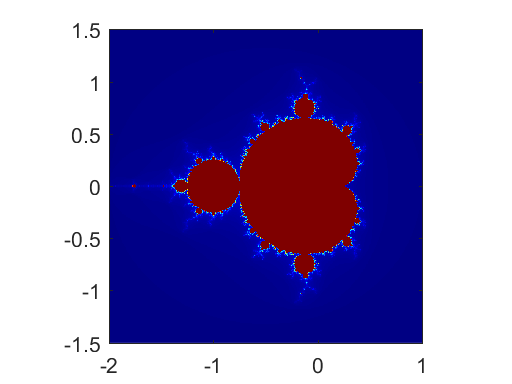

# 17 Advanced Graphics


```python
%load_ext pymatbridge
```


<!-- toc orderedList:0 depthFrom:1 depthTo:6 -->

* [17 Advanced Graphics](#17-advanced-graphics)
  * [17.1 Handle Graphics](#171-handle-graphics)
  * [17.2 Graphical user interface](#172-graphical-user-interface)
  * [17.3 Images](#173-images)

<!-- tocstop -->


## 17.1 Handle Graphics


```python

```

## 17.2 Graphical user interface


```python

```

## 17.3 Images


```python
%%matlab
x0 = -2 ; y0 = -1.5 ; d = 3 ; n = 512 ;
maxit = 256 ;
x = linspace(x0, x0+d, n) ;
y = linspace(y0, y0+d, n) ;
[x,y] = meshgrid(x, y) ;
C = x + y*1i ;
Z = C ;
K = ones(n, n) ;

for k = 1:maxit
    a = find((real(Z).^2+imag(Z).^2) < 4);
    Z(a) = (Z(a)).^2 + C(a) ;
    K(a) = k ;
end

figure(1) ; clf
colormap(jet(maxit)) ;
image(x0 + [0 d], y0 + [0 d], K) ;
set(gca, 'YDir', 'normal') ;
axis equal
axis tight
```





```python

```
