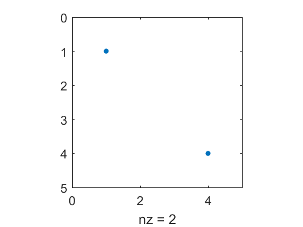
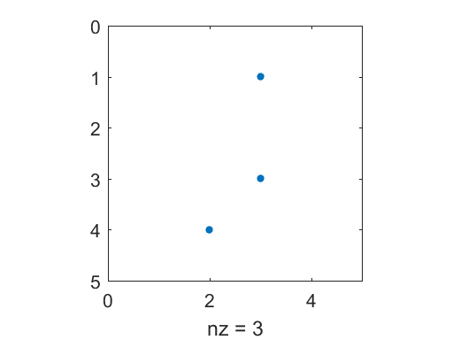

# 18 Sparse Matrix Computations


```python
%load_ext pymatbridge
```

<!-- toc orderedList:0 depthFrom:1 depthTo:6 -->

* [18 Sparse Matrix Computations](#18-sparse-matrix-computations)
  * [18.1 Storage modes](#181-storage-modes)
  * [18.2 Generating sparse matrices](#182-generating-sparse-matrices)
  * [18.3 Computation with sparse matrices](#183-computation-with-sparse-matrices)
  * [18.4 Permutation vectors and matrices](#184-permutation-vectors-and-matrices)
  * [18.5 Visualizing matrices](#185-visualizing-matrices)

<!-- tocstop -->


## 18.1 Storage modes


```python
%%matlab
F = randi([0 9], 6)
F = triu(tril(F,1), -1)
```



    F =

         4     7     9     8     6     6
         4     3     9     0     4     1
         3     2     5     0     5     3
         9     4     0     1     2     6
         3     0     2     6     7     7
         1     1     3     7     1     0


    F =

         4     7     0     0     0     0
         4     3     9     0     0     0
         0     2     5     0     0     0
         0     0     0     1     2     0
         0     0     0     6     7     7
         0     0     0     0     1     0



```python
%%matlab
S = sparse(F)
F = full(S)
```



    S =

       (1,1)        4
       (2,1)        4
       (1,2)        7
       (2,2)        3
       (3,2)        2
       (2,3)        9
       (3,3)        5
       (4,4)        1
       (5,4)        6
       (4,5)        2
       (5,5)        7
       (6,5)        1
       (5,6)        7


    F =

         4     7     0     0     0     0
         4     3     9     0     0     0
         0     2     5     0     0     0
         0     0     0     1     2     0
         0     0     0     6     7     7
         0     0     0     0     1     0



## 18.2 Generating sparse matrices


```python
%%matlab
m = 6 ;
n = 6 ;
e = ones(n,1) ;
d = -2*e ;
T = spdiags([e d e], [-1 0 1], m, n)
```



    T =

       (1,1)       -2
       (2,1)        1
       (1,2)        1
       (2,2)       -2
       (3,2)        1
       (2,3)        1
       (3,3)       -2
       (4,3)        1
       (3,4)        1
       (4,4)       -2
       (5,4)        1
       (4,5)        1
       (5,5)       -2
       (6,5)        1
       (5,6)        1
       (6,6)       -2



```python
%%matlab
i = [1 2 3 4 4 4] ;
j = [1 2 3 1 2 3] ;
s = [5 6 7 8 9 10] ;
S = sparse(i, j, s, 4, 3)
full(S)
```



    S =

       (1,1)        5
       (4,1)        8
       (2,2)        6
       (4,2)        9
       (3,3)        7
       (4,3)       10


    ans =

         5     0     0
         0     6     0
         0     0     7
         8     9    10



```python
%%matlab
i = [1 2 3 1] ;
j = [1 2 3 1] ;
s = [1 1 1 1] ;
S = sparse(i, j, s)
full(S)
```



    S =

       (1,1)        2
       (2,2)        1
       (3,3)        1


    ans =

         2     0     0
         0     1     0
         0     0     1



```python
%%matlab
n = 6 ;
e = randi([0 9], n-1, 1) ;
E = sparse(2:n, 1:n-1, e, n, n)
```



    E =

       (2,1)        9
       (3,2)        7
       (4,3)        4
       (5,4)        4
       (6,5)        4



```python
%%matlab
A = sparse(m,n) ;
for k = 1:length(s)
    A(i(k),j(k)) = s(k) ;
end
```

## 18.3 Computation with sparse matrices

```
S+S   S*S     S.      *S      S.*F
S-S   S/Z     S\Z     -S
S'    S.'     inv(S)  chol(S)
lu(S) diag(S) max(S)  sum(S)
S*n   S/n     S^n     S.^n
n\S
```

```
S+F F\S S/F S+n
S*F S\F F/S S-n
```

## 18.4 Permutation vectors and matrices

```
load west0479 ; A = west0479 ;
[L,U,P,Q] = lu(A) ;
[L,U,p,q] = lu(A, 'vector') ;
```

```
[p j x] = find(P')    % converts P*A to A(p,:)
[q j x] = find(Q)     % converts A*Q to A(:,q)
P=sparse(1:m, p, 1)   % converts A(p,:) to P*A
Q=sparse(q, 1:n, 1)   % converts A(:,q) to A*Q
```               

## 18.5 Visualizing matrices


```python
%%matlab
A = [ -1 2 3 -4
      0 2 -1 0
      1 2 9 1
      -3 4 1 1]
C = ddom(A)
figure(1) ; spy(A ~= C)
figure(2) ; spy(A > 2)
```



    A =

        -1     2     3    -4
         0     2    -1     0
         1     2     9     1
        -3     4     1     1


    C =

       -9.0000    2.0000    3.0000   -4.0000
             0    2.0000   -1.0000         0
        1.0000    2.0000    9.0000    1.0000
       -3.0000    4.0000    1.0000    8.0000









```python

```
