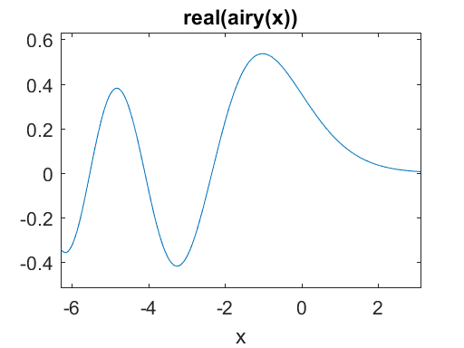
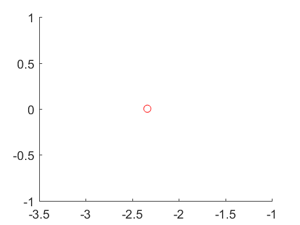
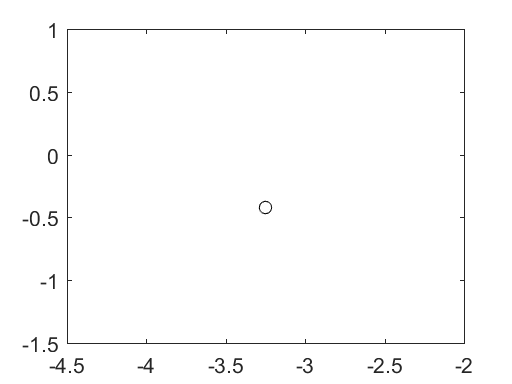
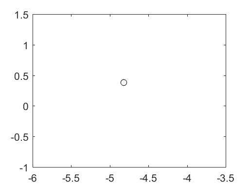
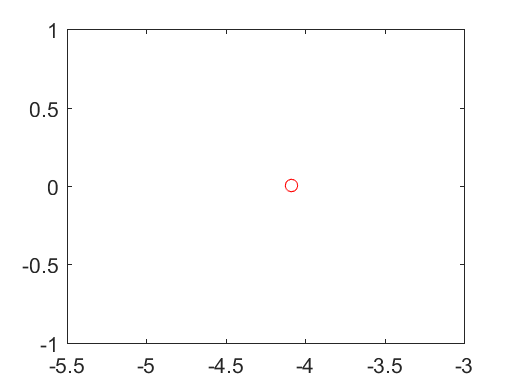
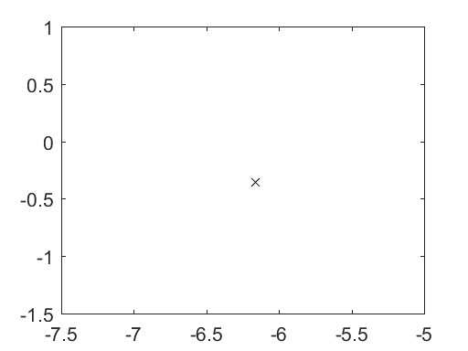

# 21 Solving Equations

```python
%load_ext pymatbridge
```


<!-- toc orderedList:0 depthFrom:1 depthTo:6 -->

* [21 Solving Equations](#21-solving-equations)
  * [21.1 Symbolic equations](#211-symbolic-equations)
  * [21.2 Linear systems of equations](#212-linear-systems-of-equations)
  * [21.3 Polynomial roots](#213-polynomial-roots)
  * [21.4 Nonlinear equations](#214-nonlinear-equations)
  * [21.5 Ordinary differential equations](#215-ordinary-differential-equations)
  * [21.6 Other differential equations](#216-other-differential-equations)

<!-- tocstop -->


Solving equations is at the core of what MATLAB does. First, we will look back at the kinds of equations you have seen so far in the book.  
Next, in this chapter you will learn how MATLAB finds numerical solutions to nonlinear equations and systems of differential equations.

## 21.1 Symbolic equations

The Symbolic Math Toolbox can solve  
symbolic **linear systems of equations** using **backslash** (Section 19.9),  
**nonlinear systems of equations** using the **solve** function (Section 19.11), and  
**systems of differential equations** using **dsolve** (Section 19.12).  
**The rest of MATLAB focuses on finding numeric solutions to equations, not symbolic.**

## 21.2 Linear systems of equations

```
A*x=b
x=A\b
```

## 21.3 Polynomial roots

```
f(x) = 0
```

## 21.4 Nonlinear equations


```python
%%matlab
fzero(@(x) x^2-2, 1)
```



    ans =

       1.414213562373095



```python
%%matlab
fa = @(x) (x-2)^2
fb = @(x) (x-2)^2 - 1e-12
```



    fa =

        @(x)(x-2)^2


    fb =

        @(x)(x-2)^2-1e-12



```python
%%matlab
fzero(fa, 1)
fzero(fb, 3)
```


    Exiting fzero: aborting search for an interval containing a sign change
        because NaN or Inf function value encountered during search.
    (Function value at -1.7162e+154 is Inf.)
    Check function or try again with a different starting value.

    ans =

       NaN

    Exiting fzero: aborting search for an interval containing a sign change
        because NaN or Inf function value encountered during search.
    (Function value at -1.8203e+154 is Inf.)
    Check function or try again with a different starting value.

    ans =

       NaN



> Both functions can be easily solved with the Symbolic Math Toolbox. Note that solve correctly reports that 2 is a double root of (x-2)^2. Try:


```python
%%matlab
syms x
solve((x-2)^2)
s = solve((x-2)^2-1e-12)
fb(s(1))
fb(s(2))
```



    ans =

                                          [2]
                                          [ ]
                                          [2]

    s =

                                     [2.000001000]
                                     [           ]
                                     [1.999999000]

    ans =

                                          0.

    ans =

                                          0.


> The zeros of fb can be found numerically only if you guess close enough, or if you provide two initial values of x for which fb differs in sign:


```python
%%matlab
fzero(fb, 2)
format long
fzero(fb, [2 3])
fzero(fb, [1 2])
```



    ans =

       1.999999000000000


    ans =

       2.000001000000000


    ans =

       1.999999000000000



```python
%%matlab
f = @(x) real(airy(x))
figure(1) ; clf
ezplot(f)
solve('real(airy(x))')
```



    f =

        @(x)real(airy(x))


    ans =

                          RootOf(airy(_Z) - RootOf(real(_Z)))





```python
%%matlab
s = fzero(f, 0)
hold on
plot(s, f(s), 'ro')
```



    s =

      -2.338107410459763






```python
%%matlab
xmin = fminbnd(f, -4, 0)
plot(xmin, f(xmin), 'ko')
```



    xmin =

      -3.248194011240023






```python
%%matlab
g = @(x) -real(airy(x))
xmax = fminbnd(g, -5, -4)
plot(xmax, f(xmax), 'ko')
```



    g =

        @(x)-real(airy(x))


    xmax =

      -4.820099516350185






```python
%%matlab
s = fzero(f, [xmax xmin])
plot(s, f(s), 'ro')
```



    s =

      -4.087949444130973






```python
%%matlab
xmin = fminsearch(f, -6)
plot(xmin, f(xmin), 'kx')
```



    xmin =

      -6.163330078125000






## 21.5 Ordinary differential equations


```python
%%matlab
syms t y
Y = dsolve('Dy = t^2*y', 'y(0)=1', 't')

% [tt,yy] = ode45(@f, tspan, y0)

f1 = @(t,y) t^2 * y
[tr,yr] = ode45(f1, [0 2], 1);

ts = 0:.05:2;
ys = subs(Y, t, ts);

figure(2) ; clf
plot(ts,ys, 'r-', tr,yr, 'bx');
legend('symbolic', 'numeric')

ys = subs(Y, t, tr);
[tr ys yr ys-yr]
err = norm(ys-yr) / norm(ys)
```


```python
%%matlab
Y = dsolve('D2y + y = t^2', 'y(0)=1', 'Dy(0)=0', 't')
```



    Y =

                                                   2
                                  -2 + 3 cos(t) + t


```python
%%matlab
f2 = @(t,y) [y(2) ; t^2-y(1)]
[tr,yy] = ode45(f2, [0 2], [1 0]');
yr = yy(:,1) ;
```



    f2 =

        @(t,y)[y(2);t^2-y(1)]



## 21.6 Other differential equations

Delay differential equations (DDEs) are solved by dde23.  
The function **bvp4c** solves boundary value ODE problems.  
Finally, partial differential equations are solved with **pdepe** and **pdeval**.  
See the online help facility for more information on these ODE, DDE, and PDE solvers.  


```python

```
