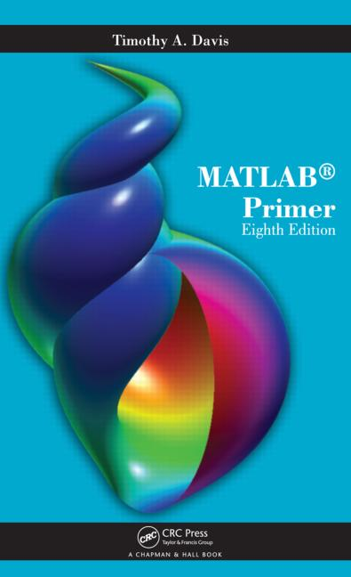

# MATLAB Primer

  

* **Publisher**  https://www.crcpress.com/MATLAB-Primer-Eighth-Edition/Davis/p/book/9781439828625  
* **Companion Site**  http://faculty.cse.tamu.edu/davis/publications.html  

## Toc
* [Ch01 Getting Started](Ch01_Getting_Started.md)  
* [Ch02 The MATLAB Desktop](Ch02_The_MATLAB_Desktop.md)  
* [Ch03 Matrices and Matrix Operations](Ch03_Matrices_and_Matrix_Operations.md)  
* [Ch04 Submatrices and Colon Notation](Ch04_Submatrices_and_Colon_Notation.md)  
* [Ch05 MATLAB Functions](Ch05_MATLAB_Functions.md)  
* [Ch06 M-Files](Ch06_M-Files.md)  
* [Ch07 Control Flow Statements](Ch07_Control_Flow_Statements.md)  
* [Ch08 Advanced Data Structures](Ch08_Advanced_Data_Structures.md)  
* [Ch09 Object-Oriented Programming](Ch09_Object-Oriented_Programming.md)  
* [Ch10 Advanced M-file Features](Ch10_Advanced_M-file_Features.md)  
* [Ch11 Code Development Tools](Ch11_Code_Development_Tools.md)  
* [Ch12 Calling C from MATLAB](Ch12_Calling_C_from_MATLAB.md)  
* [Ch13 Calling Fortran from MATLAB](Ch13_Calling_Fortran_from_MATLAB.md)  
* [Ch14 Calling Java from MATLAB](Ch14_Calling_Java_from_MATLAB.md)  
* [Ch15 Two-Dimensional Graphics](Ch15_Two-Dimensional_Graphics.md)  
* [Ch16 Three-Dimensional Graphics](Ch16_Three-Dimensional_Graphics.md)  
* [Ch17 Advanced Graphics](Ch17_Advanced_Graphics.md)  
* [Ch18 Sparse Matrix Computations](Ch18_Sparse_Matrix_Computations.md)  
* [Ch19 The Symbolic Math Toolbox](Ch19_The_Symbolic_Math_Toolbox.md)  
* [Ch20 Polynomials, Interpolation, andIntegration](Ch20_Polynomials,_Interpolation,_andIntegration.md)  
* [Ch21 Solving Equations](Ch21_Solving_Equations.md)  
* [Ch22 Displaying Results](Ch22_Displaying_Results.md)  
* [Ch23 Cell Publishing](Ch23_Cell_Publishing.md)  
 
---
* [AppA Appendix The MATLAB Top 500](AppA_Appendix_The_MATLAB_Top_500.md)  
* [AppB Desktop Tools and DevelopmentEnvironment](AppB_Desktop_Tools_and_DevelopmentEnvironment.md)  
* [AppC Data Import and Export](AppC_Data_Import_and_Export.md)  
* [AppD Mathematics](AppD_Mathematics.md)  
* [AppE Data Analysis](AppE_Data_Analysis.md)  
* [AppF Programming and Data Types](AppF_Programming_and_Data_Types.md)  
* [AppG Object-Oriented Programming](AppG_Object-Oriented_Programming.md)  
* [AppH Graphics](AppH_Graphics.md)  
* [AppI 3-D Visualization](AppI_3-D_Visualization.md)  
* [AppJ GUI Development](AppJ_GUI_Development.md)  
* [AppK External Interfaces](AppK_External_Interfaces.md)  
* [AppL Symbolic Math Toolbox](AppL_Symbolic_Math_Toolbox.md)  
